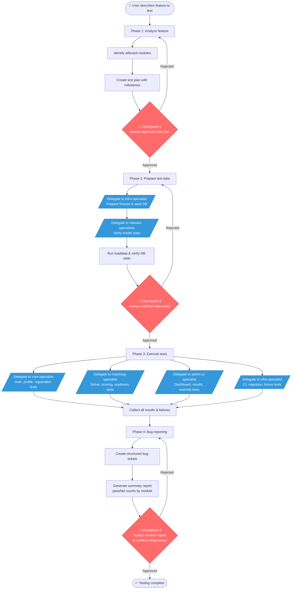
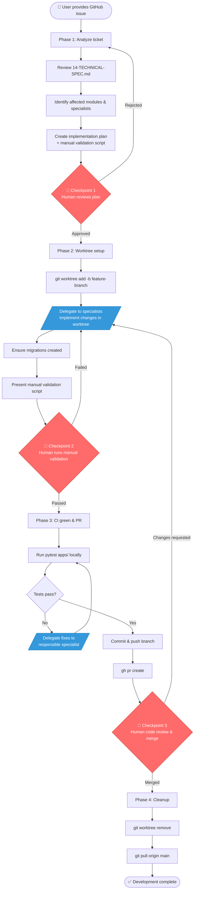
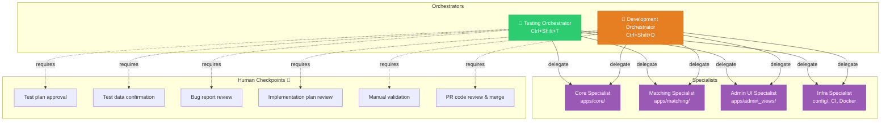

# MatchLab Multi-Agent System

## Architecture

Two orchestrator agents coordinate four specialist subagents. Each specialist owns a coherent module of the codebase with scoped write permissions.

## Agent Map

| Agent | Type | Shortcut | Domain |
|-------|------|----------|--------|
| `testing` | Orchestrator | `Ctrl+Shift+T` | E2E test planning, execution, bug reporting |
| `development` | Orchestrator | `Ctrl+Shift+D` | Ticket implementation, CI, pull requests |
| `core-specialist` | Subagent | — | `apps/core/`, auth, registration, profiles |
| `matching-specialist` | Subagent | — | `apps/matching/`, solvers, scoring, export |
| `admin-ui-specialist` | Subagent | — | `apps/admin_views/`, templates, dashboards |
| `infra-specialist` | Subagent | — | `config/`, CI, Docker, scripts, fixtures |

## Workflows

### Testing Orchestrator



### Development Orchestrator



### System Overview



## File Structure

```
.kiro/
├── agents/
│   ├── testing.json              # Testing orchestrator config
│   ├── development.json          # Development orchestrator config
│   ├── core-specialist.json      # Core & Auth subagent
│   ├── matching-specialist.json  # Matching Engine subagent
│   ├── admin-ui-specialist.json  # Admin UI subagent
│   └── infra-specialist.json     # Infrastructure subagent
├── prompts/
│   ├── testing-orchestrator.md   # Testing orchestrator system prompt
│   ├── development-orchestrator.md # Development orchestrator system prompt
│   ├── core-specialist.md        # Core specialist system prompt
│   ├── matching-specialist.md    # Matching specialist system prompt
│   ├── admin-ui-specialist.md    # Admin UI specialist system prompt
│   └── infra-specialist.md       # Infrastructure specialist system prompt
└── settings/
    └── cli.json                  # Workspace settings (delegate, thinking, todo, etc.)
```

## Usage

Switch to an orchestrator agent:
- `Ctrl+Shift+T` — Testing Orchestrator
- `Ctrl+Shift+D` — Development Orchestrator
- `/agent testing` — switch via command
- `/agent development` — switch via command

The orchestrators handle all delegation to specialists automatically. You only interact with the orchestrator.
