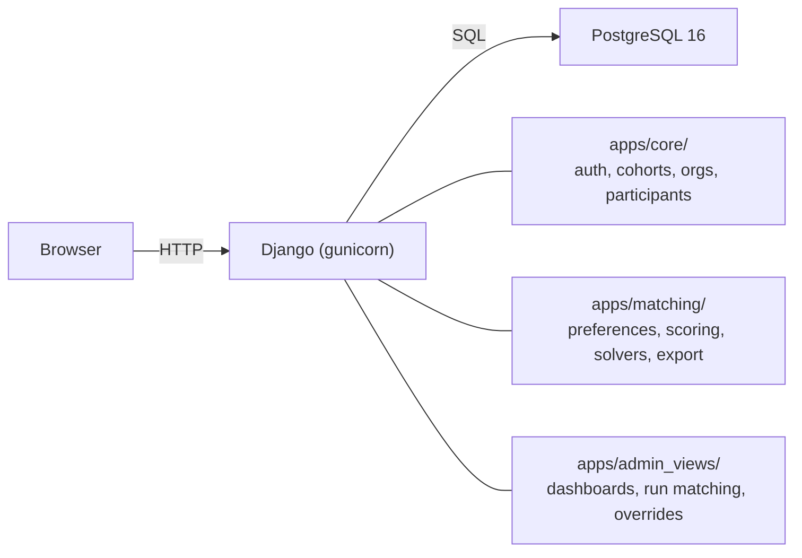
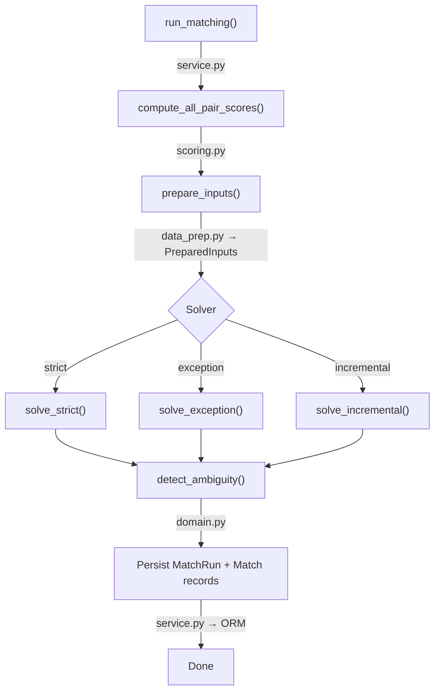

# 03 — Architecture

## High-level picture

MatchLab is a Django monolith with server-rendered HTML templates and Bootstrap 5 UI. There is no JavaScript SPA — all interactions are standard form submissions and page loads.



## Django apps

### `apps/core/`

Identity and cohort membership.

| File | Responsibility |
|------|---------------|
| `models.py` | `Cohort`, `Organization`, `Participant` |
| `views.py` | Home, registration, profile editing |
| `forms.py` | `ParticipantProfileForm`, `RegistrationForm`, `LoginForm` |
| `urls.py` | `/`, `/register/`, `/cohorts/<id>/profile/` |
| `admin.py` | Django Admin for Cohort, Organization, and Participant |

### `apps/matching/`

The matching domain — everything from preferences to solvers to export.

| File | Responsibility |
|------|---------------|
| `models.py` | `Preference`, `MentorProfile`, `MenteeProfile`, `ImportJob`, `PairScore`, `MatchRun`, `Match`, `ActiveMatchRun` |
| `views.py` | Preference ranking and submission |
| `forms.py` | `PreferencesForm` (ranked preference input) |
| `scoring.py` | Rank-based pair score computation |
| `data_prep.py` | ORM → pure data structures (`PreparedInputs`) |
| `domain.py` | Exception classification, penalty calculation, ambiguity detection |
| `service.py` | Orchestration: prep → solve → persist |
| `solvers/strict.py` | OR-Tools CP-SAT strict solver |
| `solvers/exception.py` | OR-Tools CP-SAT exception solver |
| `solvers/incremental.py` | Incremental solver (delegates to strict or exception) |
| `readiness.py` | Cohort readiness checks and diagnostics |
| `export.py` | CSV and XLSX export |
| `override.py` | Manual override logic |
| `urls.py` | `/cohorts/<id>/preferences/`, `/cohorts/<id>/preferences/submit/` |
| `admin.py` | Django Admin for Preference, MentorProfile, MenteeProfile, ImportJob |
| `templatetags/matching_extras.py` | Custom template filters |

### `apps/admin_views/`

Admin-facing UI — dashboards, matching controls, overrides.

| File | Responsibility |
|------|---------------|
| `admin_dashboard.py` | Admin dashboard listing all cohorts |
| `views.py` | Cohort dashboard (readiness/diagnostics), mentee desired attributes |
| `run_matching.py` | Run matching, view results, export |
| `override_views.py` | Manual override UI, set active run, participant "my match" view |
| `forms.py` | `MenteeDesiredAttributesForm` |
| `urls.py` | All `/dashboard/`, `/cohort/…/`, `/match-run/…/` routes |

## Request routing

Root URL configuration lives in `config/urls.py`:

```
/admin/                → Django Admin
/auth/login/           → Django auth LoginView
/auth/logout/          → core.views.logout_view
/                      → apps.core.urls
/                      → apps.matching.urls
/                      → apps.admin_views.urls
```

All three app URL files are included at the root level (no prefix). Routes are disambiguated by their path patterns.

## Folder structure

```
matchlab/
├── apps/
│   ├── core/              Auth, cohorts, participants
│   ├── matching/          Matching domain
│   │   ├── solvers/       strict.py, exception.py, incremental.py
│   │   ├── tests/         Unit and integration tests
│   │   └── templatetags/  Custom template filters
│   └── admin_views/       Admin dashboards and controls
│       └── tests/         Admin view tests
├── config/                Django settings, URLs, WSGI/ASGI
├── templates/             Server-rendered HTML
│   ├── base.html          Shared layout (Bootstrap 5 navbar, messages)
│   ├── core/              Profile, cohort selector
│   ├── matching/          Preferences editor (improved + readonly)
│   ├── admin_views/       Dashboard, run matching, results, override
│   ├── participant/       "My match" view
│   ├── auth/              Login
│   └── registration/      Registration
├── fixtures/              Django fixtures for dev and tests
├── resources/
│   ├── assets/            Front-end static assets (app.css)
│   ├── sample_data/       CSV templates and test data
│   └── staticfiles/       Collected static output (generated)
├── playwright_tests/      E2E tests
├── scripts/               Dev utility scripts
├── docs/                  This documentation
├── docker-compose.yml     Production Docker Compose
├── docker-compose.dev.yml Development Docker Compose
├── Dockerfile             Production image
├── Dockerfile.dev         Development image
└── manage.py              Django management command entry point
```

## Matching pipeline (canonical flow)



Each layer has a clear boundary. Solvers receive `PreparedInputs` (a NamedTuple of plain Python data) and return result NamedTuples — they never touch the ORM.
