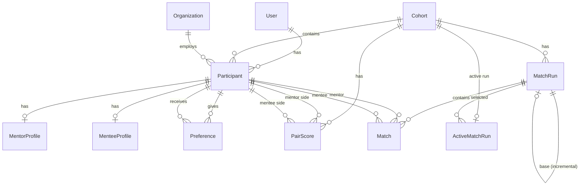

# 04 — Data Model

## Entity-relationship diagram

## Core app models (`apps/core/models.py`)

### Cohort

A grouping of mentors and mentees for matching.

| Field | Type | Notes |
|-------|------|-------|
| `id` | BigAutoField | PK |
| `name` | CharField(200) | Unique |
| `status` | CharField(20) | Choices: `DRAFT`, `OPEN`, `CLOSED`, `MATCHED` |
| `cohort_config` | JSONField | Scoring weights, thresholds (default `{}`) |
| `created_at` | DateTimeField | Auto |

### Organization

An admin-managed organization that participants can belong to. Created and maintained via Django Admin.

| Field | Type | Notes |
|-------|------|-------|
| `id` | BigAutoField | PK |
| `name` | CharField(200) | Unique |
| `is_active` | BooleanField | Default `True`; inactive orgs hidden from dropdowns |
| `created_at` | DateTimeField | Auto |

Ordering: `["name"]`.

### Participant

A user participating in a cohort as either mentor or mentee.

| Field | Type | Notes |
|-------|------|-------|
| `id` | BigAutoField | PK |
| `cohort` | FK → Cohort | CASCADE |
| `user` | FK → User | CASCADE |
| `role_in_cohort` | CharField(10) | `MENTOR` or `MENTEE` |
| `display_name` | CharField(200) | |
| `organization` | FK → Organization | PROTECT, nullable — admin-managed dropdown |
| `is_submitted` | BooleanField | Default `False` |
| `submitted_at` | DateTimeField | Nullable |
| `created_at` | DateTimeField | Auto |
| `updated_at` | DateTimeField | Auto |

Constraints:
- `unique_together = ("cohort", "user")` — one participation per cohort per user.
- Index on `(cohort, role_in_cohort)`.

## Matching app models (`apps/matching/models.py`)

### Preference

A ranked preference from one participant to another.

| Field | Type | Notes |
|-------|------|-------|
| `id` | BigAutoField | PK |
| `from_participant` | FK → Participant | CASCADE, related: `given_preferences` |
| `to_participant` | FK → Participant | CASCADE, related: `received_preferences` |
| `rank` | PositiveIntegerField | 1 = top choice |

Constraints:
- `unique_together = ("from_participant", "to_participant")`.
- Index on `(from_participant, rank)`.
- Ordering: `["from_participant", "rank"]`.

### MentorProfile

Extended profile for mentors (one-to-one with Participant).

| Field | Type | Notes |
|-------|------|-------|
| `participant` | OneToOne → Participant | CASCADE, related: `mentor_profile` |
| `job_title` | CharField(200) | Blank |
| `function` | CharField(200) | Blank |
| `expertise_tags` | TextField | Comma-separated |
| `years_experience` | IntegerField | Nullable |
| `bio` | TextField | Blank |
| `created_at` | DateTimeField | Auto |
| `updated_at` | DateTimeField | Auto |

### MenteeProfile

Extended profile for mentees (one-to-one with Participant).

| Field | Type | Notes |
|-------|------|-------|
| `participant` | OneToOne → Participant | CASCADE, related: `mentee_profile` |
| `job_title` | CharField(200) | Blank |
| `function` | CharField(200) | Blank |
| `years_experience` | IntegerField | Nullable |
| `desired_attributes` | JSONField | Default `{}` |
| `bio` | TextField | Blank |
| `created_at` | DateTimeField | Auto |
| `updated_at` | DateTimeField | Auto |

### ImportJob

Tracks CSV import jobs.

| Field | Type | Notes |
|-------|------|-------|
| `id` | BigAutoField | PK |
| `name` | CharField(200) | |
| `status` | CharField(20) | `PENDING`, `PROCESSING`, `PREVIEW`, `COMPLETED`, `FAILED` |
| `file_path` | CharField(500) | Blank |
| `error_message` | TextField | Blank |
| `total_rows` | IntegerField | Default 0 |
| `processed_rows` | IntegerField | Default 0 |
| `created_at` | DateTimeField | Auto |
| `updated_at` | DateTimeField | Auto |

### PairScore

Computed match scores between mentor-mentee pairs.

| Field | Type | Notes |
|-------|------|-------|
| `id` | BigAutoField | PK |
| `cohort` | FK → Cohort | CASCADE, related: `pair_scores` |
| `mentor` | FK → Participant | CASCADE, related: `mentor_scores` |
| `mentee` | FK → Participant | CASCADE, related: `mentee_scores` |
| `score` | FloatField | 0–100 percentage |
| `score_breakdown` | JSONField | Detailed breakdown |
| `computed_at` | DateTimeField | Auto |

Constraints:
- `unique_together = ("mentor", "mentee")`.
- Indexes on `(cohort, -score)`, `(mentor, -score)`, `(mentee, -score)`.

### MatchRun

A matching run execution.

| Field | Type | Notes |
|-------|------|-------|
| `id` | BigAutoField | PK |
| `cohort` | FK → Cohort | CASCADE |
| `created_by` | FK → User | CASCADE |
| `mode` | CharField(15) | `STRICT`, `EXCEPTION`, `INCREMENTAL` |
| `status` | CharField(10) | `SUCCESS`, `FAILED` |
| `base_match_run` | FK → self | SET_NULL, nullable — for incremental mode |
| `objective_summary` | JSONField | Totals, exception counts, solve time |
| `failure_report` | JSONField | Diagnostics when status=FAILED |
| `input_signature` | TextField | SHA-256 hash of inputs for traceability |
| `created_at` | DateTimeField | Auto |

Ordering: `["-created_at"]`.

### Match

A single mentor-mentee match from a match run.

| Field | Type | Notes |
|-------|------|-------|
| `id` | BigAutoField | PK |
| `match_run` | FK → MatchRun | CASCADE, related: `matches` |
| `mentor` | FK → Participant | CASCADE, related: `mentor_matches` |
| `mentee` | FK → Participant | CASCADE, related: `mentee_matches` |
| `score_percent` | IntegerField | 0–100 |
| `ambiguity_flag` | BooleanField | Default `False` |
| `ambiguity_reason` | TextField | Blank |
| `exception_flag` | BooleanField | Default `False` |
| `exception_type` | CharField(20) | `""`, `E1`, `E2`, `E3` |
| `exception_reason` | TextField | Blank |
| `is_manual_override` | BooleanField | Default `False` |
| `override_reason` | TextField | Blank |

Constraints:
- `unique_together = (("match_run", "mentor"), ("match_run", "mentee"))` — enforces one-to-one within a run.

### ActiveMatchRun

The currently active match run for a cohort (one per cohort).

| Field | Type | Notes |
|-------|------|-------|
| `cohort` | OneToOne → Cohort | CASCADE |
| `match_run` | FK → MatchRun | CASCADE |
| `set_by` | FK → User | CASCADE |
| `set_at` | DateTimeField | Auto |

## Migration history

| Migration | Description |
|-----------|-------------|
| `core/0001_initial` | Cohort, Organization, Participant (organization as FK → Organization) |
| `core/0002_cohort_cohort_config` | Add `cohort_config` JSONField |
| `matching/0001_initial` | Preference |
| `matching/0002_importjob_menteeprofile_mentorprofile` | ImportJob, MenteeProfile, MentorProfile |
| `matching/0003_pairscore` | PairScore |
| `matching/0004_add_match_models` | MatchRun, Match, ActiveMatchRun |
| `matching/0005_simplify_profiles` | Simplify profile fields |
| `matching/0005_matchrun_base_match_run_alter_matchrun_mode` | Add `base_match_run` FK, add INCREMENTAL mode |
| `matching/0006_merge_0005` | Merge conflicting 0005 migrations |
