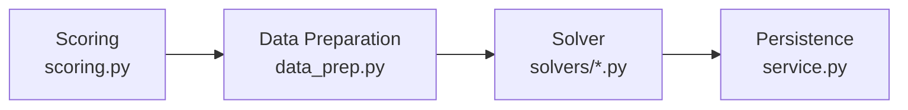

# 08 — Matching Pipeline

## Overview

The matching pipeline transforms participant preferences into optimal one-to-one pairings. It has four stages:



All orchestrated by `service.py:run_matching()`.

## Stage 1: Scoring (`scoring.py`)

### What it computes

A match percentage (0–100) for every mentor-mentee pair in the cohort, based on mutual preference ranks.

### Algorithm

```
rank_score(rank, max_rank) = 1 - (rank - 1) / max(max_rank - 1, 1)
```

- Rank 1 → score 100.
- Last rank → score 0.
- If either participant didn't rank the other → score 0.

The pair score is the average of both sides:

```
pair_score = (mentor_rank_score + mentee_rank_score) / 2
```

### Storage

Scores are stored in `PairScore` with a `score_breakdown` JSON containing `mentor_rank_score`, `mentee_rank_score`, and `overall_score`.

`compute_all_pair_scores(cohort)` deletes existing scores and recomputes all pairs.

### Note on spec vs implementation

The technical spec (§6.2) defines a weighted scoring model with four components: rank (40%), tag overlap (30%), desired attributes (20%), alignment (10%). The current implementation uses **rank only**. The infrastructure for weighted scoring exists in the spec but is not yet implemented.

## Stage 2: Data preparation (`data_prep.py`)

### Purpose

Isolate all ORM queries into a single layer that produces pure data structures for the solver. Solvers never touch the database.

### Output: `PreparedInputs`

A NamedTuple with:

| Field | Type | Description |
|-------|------|-------------|
| `mentor_ids` | `List[int]` | IDs of submitted mentors |
| `mentee_ids` | `List[int]` | IDs of submitted mentees |
| `same_org` | `Dict[(int,int), bool]` | True if mentor and mentee share an organization (compared by FK ID) |
| `participant_orgs` | `Dict[int, str]` | Organization name by participant ID |
| `acceptability` | `Dict[(int,int), str]` | `MUTUAL`, `ONE_SIDED_MENTOR_ONLY`, `ONE_SIDED_MENTEE_ONLY`, `NEITHER` |
| `score` | `Dict[(int,int), int]` | Scaled integer scores (raw × 1000) |
| `config` | `Dict[str, any]` | Merged cohort config + defaults |

Participants are queried with `select_related("organization")` to avoid N+1 queries.

### Same-org comparison

The `same_org` matrix compares `organization_id` FK values (not string names):
- Both `NULL` → treated as same org (prevents matching two unassigned participants).
- One `NULL`, one set → different org.
- Both set → compare FK IDs.

### Acceptability classification

For each mentor-mentee pair:
- **MUTUAL**: both ranked each other.
- **ONE_SIDED_MENTOR_ONLY**: mentor ranked mentee, mentee did not.
- **ONE_SIDED_MENTEE_ONLY**: mentee ranked mentor, mentor did not.
- **NEITHER**: neither ranked the other.

### Default configuration

```python
{
    "min_options_strict": 3,
    "strict_time_limit": 5,        # seconds
    "exception_time_limit": 10,     # seconds
    "penalty_org": 1_000_000,
    "penalty_one_sided": 100_000,
    "penalty_neither": 300_000,
    "score_scale": 1000,
    "ambiguity_gap_threshold": 5.0, # percentage points
}
```

These defaults can be overridden per cohort via `cohort_config` JSON.

### Incremental preparation

`prepare_incremental_inputs()` works the same way but excludes participants already matched in a base run.

## Stage 3: Solvers

### Strict solver (`solvers/strict.py`)

**Goal**: Find the optimal one-to-one matching that satisfies all hard constraints.

**Hard constraints**:
1. Different organizations (`same_org == False`).
2. Mutual acceptability (`acceptability == "MUTUAL"`).
3. Each mentor matched exactly once.
4. Each mentee matched exactly once.

**Objective**: Maximize total score.

**Pre-checks**:
- If mentor count ≠ mentee count → fail with `COUNT_MISMATCH`.
- If no participants → fail with `NO_PARTICIPANTS`.

**Feasibility**: Only pairs satisfying both constraints get decision variables. If any participant has zero feasible options, the model is infeasible.

**Time limit**: `strict_time_limit` (default 5s).

**Returns**: `StrictSolverResult` — success flag, matches list, scores, solve time, failure report.

**Failure diagnostics**: When infeasible, reports which participants have zero feasible options.

### Exception solver (`solvers/exception.py`)

**Goal**: Always produce a complete one-to-one matching, even if it requires policy violations.

**Constraints**: Same assignment constraints (each participant matched exactly once). No pairs are forbidden.

**Penalties** (applied to the objective, not as constraints):

| Exception | Penalty | Priority |
|-----------|---------|----------|
| E3: Same organization | `penalty_org` (1,000,000) | Highest — avoided first |
| E2: Neither acceptable | `penalty_neither` (300,000) | High |
| E1: One-sided acceptable | `penalty_one_sided` (100,000) | Medium |

**Objective**: `maximize Σ(score × scale) - Σ(penalty)`.

The penalty hierarchy ensures the solver:
1. Avoids org violations above all else.
2. Prefers mutual acceptability.
3. Uses one-sided acceptability before "neither accepts".
4. Within the same violation tier, maximizes score.

**Time limit**: `exception_time_limit` (default 10s).

**Returns**: `ExceptionSolverResult` — includes exception count and summary by type (E1/E2/E3).

**Exception classification** (from `domain.py`):

| Type | Condition | Reason |
|------|-----------|--------|
| E3 | Same organization | "Same organization: {org}" |
| E2 | Neither ranked the other | "Neither participant ranked the other" |
| E1 | One side didn't rank | "Mentee did not rank mentor" or "Mentor did not rank mentee" |

### Incremental solver (`solvers/incremental.py`)

**Goal**: Match only participants not already matched in a base run.

**How it works**:
1. `prepare_incremental_inputs()` excludes already-matched participants.
2. Existing matches from the base run are copied to the new run.
3. The incremental solver delegates to either strict or exception mode (defaults to exception for flexibility).

## Stage 4: Persistence (`service.py`)

After the solver returns:

### On success:
1. Detect ambiguities via `domain.py:detect_ambiguity()`.
2. Update `MatchRun.status = "SUCCESS"` with `objective_summary` JSON.
3. Create `Match` records for each pair with scores, ambiguity flags, and exception flags.

### On failure:
1. Update `MatchRun.status = "FAILED"` with `failure_report` JSON.

### Input signature

Every `MatchRun` stores an `input_signature` — a SHA-256 hash of all participant data, preferences, and cohort config. This detects if inputs changed between runs.

## Ambiguity detection (`domain.py`)

A match is flagged as ambiguous if the score gap between the assigned partner and the best alternative is ≤ `ambiguity_gap_threshold` (default 5 percentage points).

Checked for both sides (mentor's perspective and mentee's perspective). The ambiguity reason includes both scores and the gap.

## Readiness checks (`readiness.py`)

Before matching, the cohort dashboard runs these checks:

| Check | What it verifies |
|-------|-----------------|
| `check_counts_mismatch` | Equal number of submitted mentors and mentees |
| `check_missing_org` | All participants have organization set |
| `check_missing_submissions` | All participants have submitted preferences |
| `check_mutual_acceptability` | Every participant has ≥ `min_options_strict` mutual cross-org options |

Additional diagnostics:
- `get_zero_option_participants()` — participants with no feasible matches.
- `get_lowest_option_participants()` — bottom 5 by option count.
- `get_org_distribution()` — mentor/mentee counts per organization.
- `get_diagnostics_report()` — combines all checks with suggested actions.
