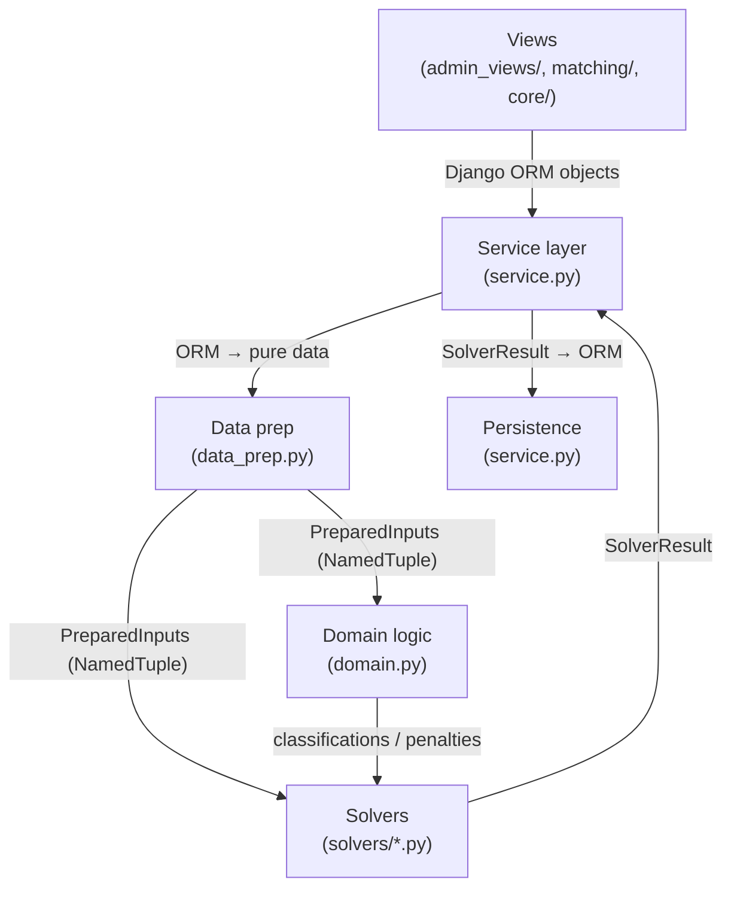

# 09 — Data Flow & Contracts

This document traces the complete request lifecycle for the two most important operations: running a match and submitting preferences. It also documents the data contracts between layers.

## Layer boundaries



Key rule: **Solvers and domain logic never import Django models or touch the database.** They operate exclusively on `PreparedInputs` and return plain NamedTuples.

## Data contract: PreparedInputs

The bridge between ORM and pure logic. Produced by `data_prep.py`, consumed by solvers and domain functions.

```python
class PreparedInputs(NamedTuple):
    mentor_ids: List[int]
    mentee_ids: List[int]
    same_org: Dict[Tuple[int, int], bool]
    participant_orgs: Dict[int, str]
    acceptability: Dict[Tuple[int, int], str]   # MUTUAL | ONE_SIDED_* | NEITHER
    score: Dict[Tuple[int, int], int]           # scaled integers (raw × 1000)
    config: Dict[str, any]
```

## Data contract: StrictSolverResult

```python
class StrictSolverResult(NamedTuple):
    success: bool
    matches: List[Dict[str, Any]]   # [{"mentor_id", "mentee_id", "score"}]
    total_score: float
    avg_score: float
    solve_time: float
    failure_report: Dict[str, Any]  # populated only when success=False
```

## Data contract: ExceptionSolverResult

```python
class ExceptionSolverResult(NamedTuple):
    success: bool
    matches: List[Dict[str, Any]]   # [{"mentor_id", "mentee_id", "score",
                                    #   "exception_flag", "exception_type",
                                    #   "exception_reason"}]
    total_score: float
    avg_score: float
    solve_time: float
    exception_count: int
    exception_summary: Dict[str, int]   # {"E1": n, "E2": n, "E3": n}
    failure_report: Dict[str, Any]
```

## Data contract: ExceptionClassification

```python
class ExceptionClassification(NamedTuple):
    exception_type: str   # "E1", "E2", "E3", or ""
    reason: str           # human-readable explanation
```

## Data contract: PenaltyInfo

```python
class PenaltyInfo(NamedTuple):
    penalty_value: int
    penalty_type: str     # "E1", "E2", "E3", or ""
```

---

## Flow 1: Run matching (POST `/cohort/<id>/run-matching/`)

```
1. run_matching_view()                          # admin_views/run_matching.py
   ├── Validates mode (STRICT/EXCEPTION/INCREMENTAL)
   ├── For INCREMENTAL: loads base_match_run, validates SUCCESS status
   └── Calls service.run_matching(cohort, user, mode, base_match_run)

2. run_matching()                               # matching/service.py
   ├── Creates MatchRun record (status=FAILED initially)
   ├── compute_all_pair_scores(cohort)          # scoring.py
   │   └── For each mentor×mentee: compute rank scores, store PairScore
   ├── prepare_inputs(cohort)                   # data_prep.py
   │   ├── Query submitted mentors and mentees (with select_related("organization"))
   │   ├── Build same_org matrix (compares organization_id FK values)
   │   ├── Build acceptability matrix (bulk query Preferences)
   │   ├── Get scaled scores from PairScore table
   │   └── Return PreparedInputs
   ├── solve_strict(inputs)                     # solvers/strict.py
   │   ├── Compute feasible pairs (diff org + mutual)
   │   ├── Build CP-SAT model with assignment constraints
   │   ├── Maximize total score
   │   ├── Solve with time limit
   │   └── Return StrictSolverResult
   ├── _handle_successful_result()
   │   ├── detect_ambiguity(matches, inputs)    # domain.py
   │   ├── Update MatchRun status=SUCCESS, objective_summary
   │   └── Create Match records (with ambiguity + exception flags)
   └── Return MatchRun

3. run_matching_view() (continued)
   ├── On SUCCESS: redirect to match_results_view
   └── On FAILED: render run_matching.html with failure report
```

## Flow 2: Submit preferences (POST `/cohorts/<id>/preferences/submit/`)

```
1. submit_preferences_view()                    # matching/views.py
   ├── Verify user is participant in cohort
   ├── Check not already submitted
   ├── Set participant.is_submitted = True
   └── Redirect to preferences (read-only view)
```

## Flow 3: Save preferences (POST `/cohorts/<id>/preferences/`)

```
1. preferences_view()                           # matching/views.py
   ├── Load participant and candidates
   ├── Filter out same-org candidates (unless show_blocked=true)
   ├── Validate PreferencesForm
   │   ├── Collect all non-empty ranks
   │   └── Detect duplicate ranks
   ├── form.save()
   │   ├── Delete existing Preference records
   │   ├── Resolve duplicate ranks by renumbering
   │   └── Bulk create new Preference records
   └── Redirect with success message
```

## Flow 4: Manual override (POST `/match-run/<id>/override/`)

```
1. override_view()                              # admin_views/override_views.py
   ├── Validate mentor and mentee selection
   ├── Check for swap suggestion
   │   └── get_swap_suggestion()                # matching/override.py
   ├── If swap exists and not confirmed → show confirmation
   └── create_manual_override()                 # matching/override.py
       ├── validate_override_pair()
       │   ├── Both in same cohort?
       │   ├── Correct roles?
       │   └── Both submitted?
       ├── classify_exception() for the new pair
       ├── If exception: require override_reason
       ├── Delete existing matches for both participants
       └── Create new Match (is_manual_override=True)
```

## Flow 5: Export (GET `/match-run/<id>/export/?format=csv|xlsx`)

```
1. export_match_run_view()                      # admin_views/run_matching.py
   ├── Verify admin access and SUCCESS status
   ├── export_match_run_csv() or export_match_run_xlsx()
   │   └── get_match_run_results()              # matching/service.py
   │       └── Query Match records with select_related("mentor", "mentee", "mentor__organization", "mentee__organization")
   └── Return HttpResponse with file attachment
```

## Flow 6: Participant views their match (GET `/cohort/<id>/my-match/`)

```
1. my_match_view()                              # admin_views/override_views.py
   ├── Verify participant in cohort
   └── get_active_match_for_participant()        # matching/override.py
       ├── Look up ActiveMatchRun for cohort
       └── Query Match for participant in that run
```
